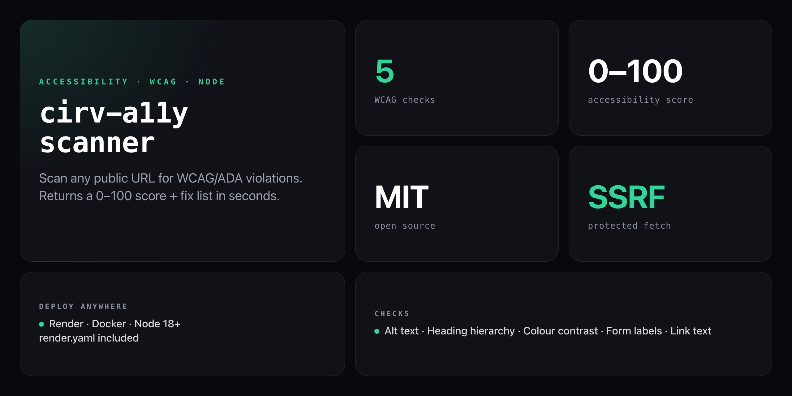

<div align="center">

**Scan any public URL for WCAG/ADA violations. Returns a 0–100 accessibility score + issue list in seconds.**


</div>

---

Cirv A11y Scanner is the free, hosted top-of-funnel for the [Cirv Guard](https://wordpress.org/plugins/cirv-guard/) WordPress plugin. Enter a URL → the server fetches the page → runs 5 WCAG checks ported rule-for-rule from `cirv-guard.php` → returns a 0–100 score + a full issue list with element context. The checks agree exactly with the plugin so users see the same results before and after installing Guard.

```
POST /api/scan  { "url": "https://example.com" }

{
  "url": "https://example.com",
  "score": 72,
  "passes": 3,
  "fails": 2,
  "total": 5,
  "results": [
    { "status": "fail", "check": "Alt Text", "wcag": "A (1.1.1)",
      "message": "Image missing alt attribute",
      "element": "" },
    { "status": "fail", "check": "Heading Hierarchy", "wcag": "A (1.3.1)",
      "message": "Heading level skipped: H2 to H4",
      "element": "<h4>Features</h4>" },
    { "status": "pass", "check": "Color Contrast", "wcag": "AA (1.4.3)",
      "message": "No inline color pairs found to check", "element": "" },
    ...
  ]
}
```

## Deploy

No npm account needed — clone and deploy straight to Render (a `render.yaml` is included):

```bash
git clone https://github.com/NickCirv/cirv-a11y-scanner
cd cirv-a11y-scanner
npm install
npm start        # serves on :3000
```

**One-click Render deploy:** connect the repo in Render as a Node web service. Build command: `npm install`. Start command: `node server/index.js`. No env vars required.

```bash
npm test         # unit tests: checks + SSRF guard
```

## API

### `POST /api/scan`

| Field | Type | Description |
|-------|------|-------------|
| `url` | string | The public URL to scan (http/https only) |

**Response:**

| Field | Type | Description |
|-------|------|-------------|
| `score` | number | 0–100 accessibility score |
| `passes` | number | Number of passing checks |
| `fails` | number | Number of failing checks |
| `total` | number | Total check results |
| `results` | array | Per-issue objects with `status`, `check`, `wcag`, `message`, `element` |

### `GET /healthz`

Returns `{ "ok": true }` — use for uptime monitoring.

## WCAG Checks

All 5 checks are ported rule-for-rule from `cirv-guard.php` so the public scanner and the plugin agree exactly.

| Check | WCAG Criterion | What it catches |
|-------|---------------|-----------------|
| Alt Text | A (1.1.1) | `` elements missing an `alt` attribute (up to 20 flagged) |
| Heading Hierarchy | A (1.3.1) | Missing H1, multiple H1s, skipped heading levels |
| Color Contrast | AA (1.4.3) | Inline `style` color pairs with ratio < 4.5:1 (WCAG AA minimum) |
| Form Labels | A (1.3.1) | Inputs with no `<label>`, `aria-label`, `aria-labelledby`, or `title` |
| Link Text | A (2.4.4) | Empty links and generic text ("click here", "read more", etc.) |

## Security

`server/fetch.js` blocks SSRF on every request and redirect hop:

- **Protocol check** — only `http:` and `https:` are accepted
- **DNS resolution + IP block** — resolves the hostname and rejects private, loopback, link-local, CGNAT, and cloud-metadata ranges (10/8, 127/8, 169.254/16, 172.16–31/12, 192.168/16, 100.64–127/10)
- **Redirect re-validation** — each redirect destination is fully re-checked before following (max 3 hops)
- **Size + timeout caps** — 3 MB response cap, 12s timeout
- **DOM-safe UI** — the frontend builds results with DOM methods, never `innerHTML`, so untrusted page content can't execute

## Structure

```
server/fetch.js    safe remote fetch + SSRF guard
server/checks.js   the 5 WCAG checks + 0–100 score
server/index.js    Express: GET / (static UI), POST /api/scan
public/index.html  single-page scan UI
render.yaml        Render web-service config
test.js            assertions for checks + SSRF guard
```

## What it is NOT

- **Not a full WCAG audit tool.** It covers 5 targeted criteria. Computed CSS contrast (non-inline), ARIA roles, keyboard navigation, and screen-reader testing are out of scope — that's [Cirv Guard Pro](https://wordpress.org/plugins/cirv-guard/).
- **Not a prevention tool.** It scans a live URL on demand, it doesn't integrate into your build pipeline or block deploys.
- **Not a guarantee of compliance.** Pattern-based checks can miss edge cases and surface false positives. Use results as a starting point, not a legal certification.

---

<div align="center">
<sub>Node 18+ · MIT · by <a href="https://github.com/NickCirv">NickCirv</a> · powers the <a href="https://wordpress.org/plugins/cirv-guard/">Cirv Guard</a> funnel</sub>
</div>
